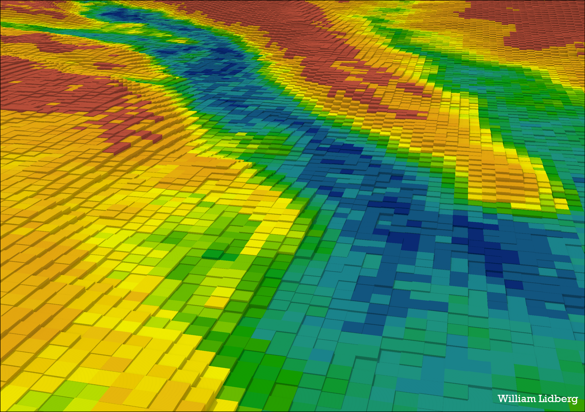

# SLU-Markfuktighetskarta
This project uses machine learning to map soil moisture in swedish forests and is based on two publications:

Anneli M. Ågren, Johannes Larson, Siddhartho Shekhar Paul, Hjalmar Laudon, William Lidberg,
Use of multiple LIDAR-derived digital terrain indices and machine learning for high-resolution national-scale soil moisture mapping of the Swedish forest landscape,
Geoderma, Volume 404, 2021, 115280, ISSN 0016-7061, https://doi.org/10.1016/j.geoderma.2021.115280.

Lidberg, W., Nilsson, M. & Ågren, A. Using machine learning to generate high-resolution wet area maps for planning forest management: A study in a boreal forest landscape. Ambio 49, 475–486 (2020). https://doi.org/10.1007/s13280-019-01196-9

The topographical indices used was extracted using code in the script folder and the script Tune2ClassedProbability.Rmd was used to train the model using XGBoost in R.

The maps can be downloaded from:
The swedish forest agency: https://www.skogsstyrelsen.se/sjalvservice/karttjanster/geodatatjanster/ftp/
The Swedish University of Agricultural Sciences: https://md.nordu.net/role/idp.ds?entityID=https%3A%2F%2Fzeus.slu.se%2Fshibboleth&return=https%3A%2F%2Fzeus.slu.se%2FShibboleth.sso%2FLogin%3FSAMLDS%3D1%26target%3Dss%253Amem%253Aebf97d79a250282574b73e852b84e7653b132140cc02beeb6bb2b0255bb2e610
The maps are also avalible to view online: https://kartor.skogsstyrelsen.se/kartor/?startapp=skogligagrunddata

